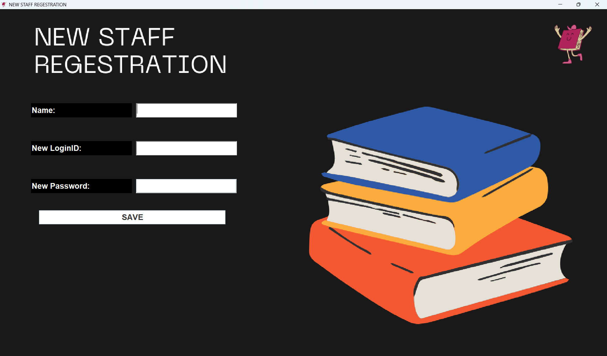
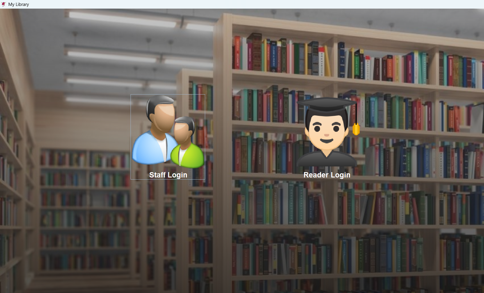
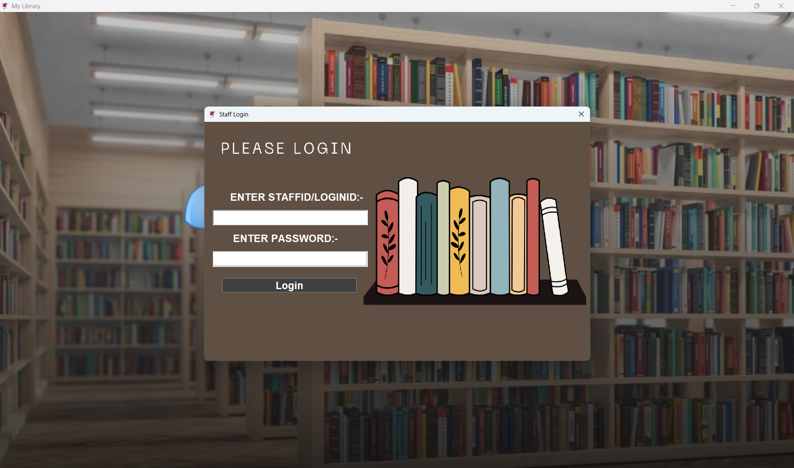
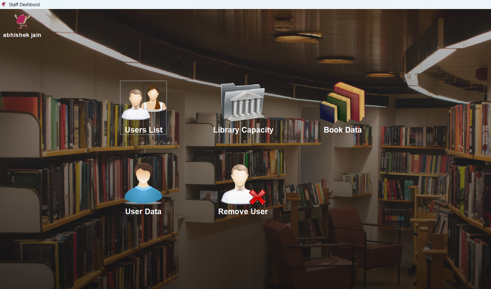
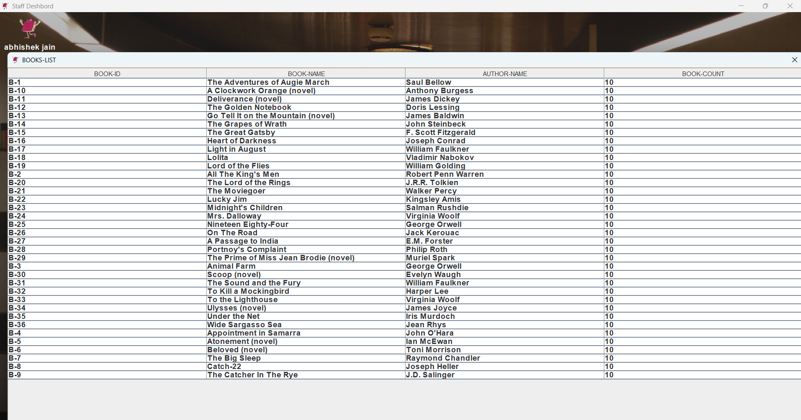
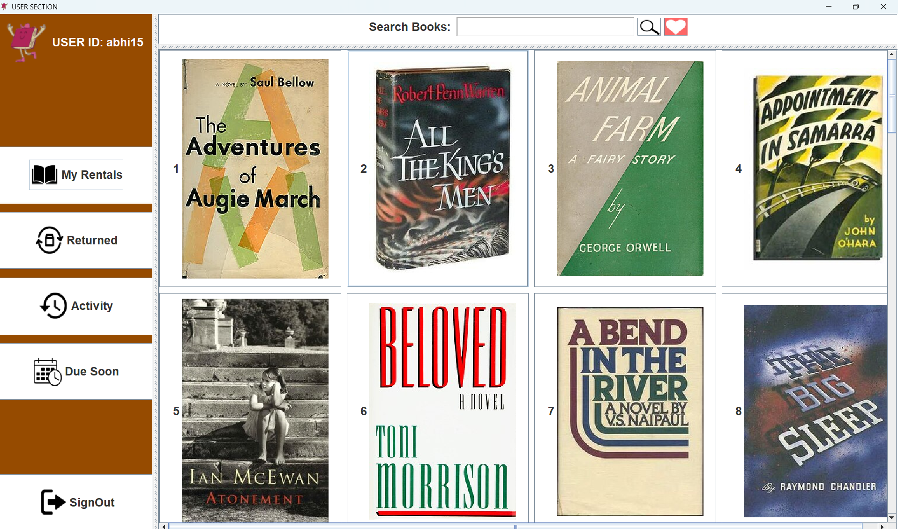
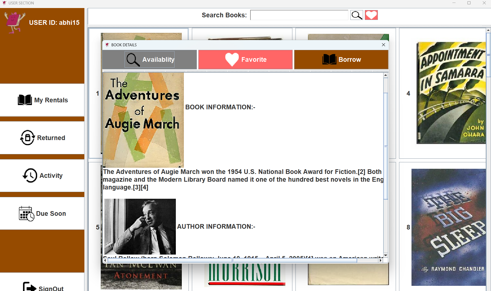
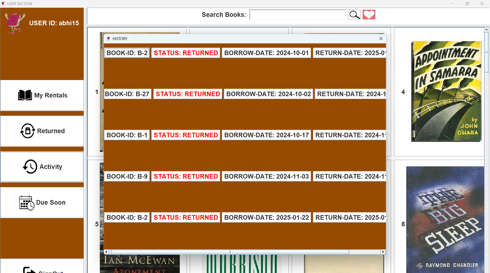

# 📚 LibraCoreSystem — Enterprise Library Management in Java

**LibraCoreSystem** is a robust, multi-role desktop application for managing library operations at scale. Built with JavaFX, Swing, and SQL, it features manager, staff, and user modules with secure authentication, real-time book scraping, and automated book tracking.

---

## 🧩 System Modules

### 👨‍💼 Manager Panel
- Register/remove staff accounts
- Monitor system activity
- Secure login credentials

### 🧑‍💼 Staff Panel
- Login with staff credentials
- Register/remove users
- Manage book inventory and availability
- Track borrowed books and due dates
- Notify users of upcoming returns

### 👤 User Panel
- Login with assigned credentials
- Browse and borrow trending books (scraped from Wikipedia)
- View borrowing history and return status
- Books auto-returned after 7 days

---

## 🖼️ Visual Preview

### 🧑‍💼 Manager Dashboard

  
*Register and manage staff accounts.*

---

### 📊 Dashboard

  
*Access user and book data with full control.*

---

### 🔐 Staff Login

  
*Secure authentication for staff members.*

---

### 📊 Staff Dashboard View

  
*Monitor book availability and user activity.*

---

### 📚 Book Inventory

  
*Track borrowed books, due dates, and availability.*

---

### 👤 User Dashboard

  
*Browse trending books and borrow with one click.*

---

### 📖 Book Details View

  
*Clicking on a book reveals detailed info — title, author, synopsis, and metadata scraped from Wikipedia..*

---

### 🕒 User History

  
*View borrowing logs and return status.*

---

## 🛠️ Tech Stack

| Layer       | Technology         |
|-------------|---------------------|
| UI          | JavaFX, Swing       |
| Backend     | Java                |
| Database    | SQL (Relational)    |
| Scraping    | Selenium + Jsoup + Wikipedia |
| Auth        | Custom Java Auth Logic |

---

## 🚀 Getting Started

To run locally:

```bash
# Clone the repository
git clone https://github.com/abhi041540/LibraCoreSystem.git
cd LibraCoreSystem

# Compile and run
javac Main.java
java Main
